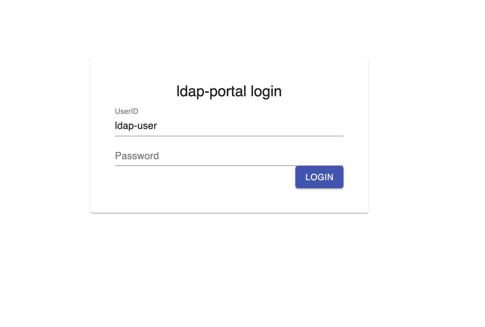
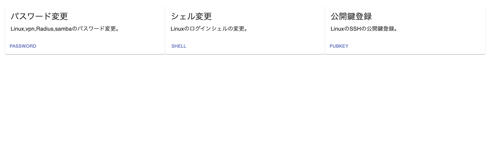
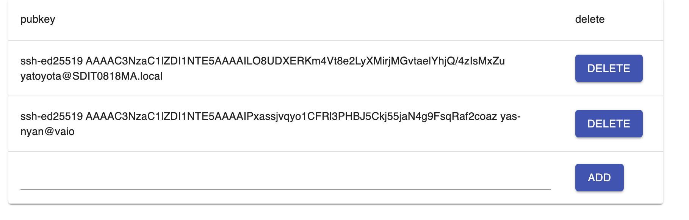

# ldap-portal
A simple and lightweight LDAP portal application.
You can change passwords, login shells, and add or delete public keys.






## How to deploy

### 1. create .env file

```
LDAP_URI=ldap://ldap.example.com/
LDAP_DOMAIN=dc=example,dc=com
ADMINCN=admin
SECRET=SECRETKEY
PASSWORD=admincn_password
```

### 2. docker run

```
docker-compose up -d
```

## LDAP Schema
Here is the LDAP schema that this application is based on.
[schema](docs/schema)

